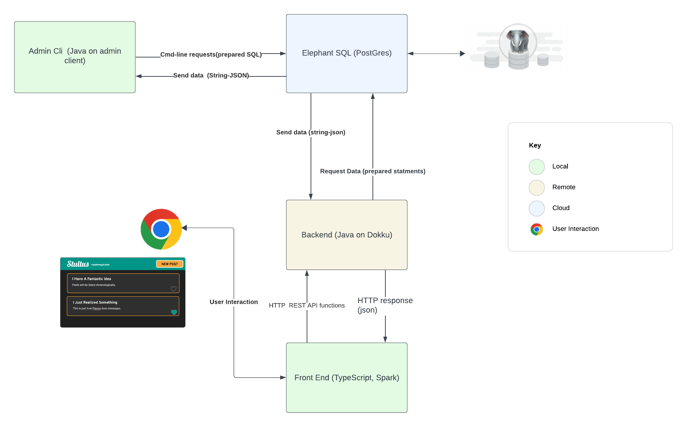
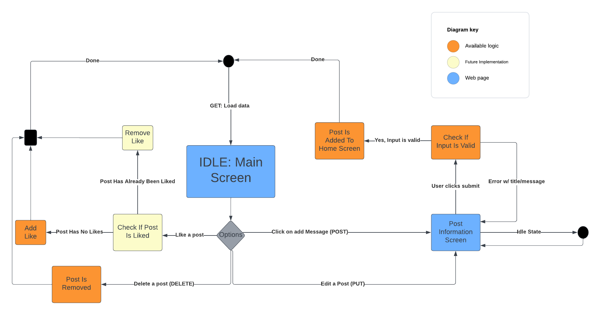
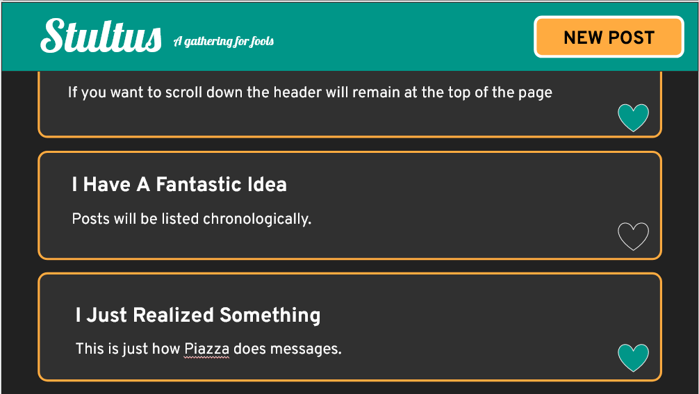
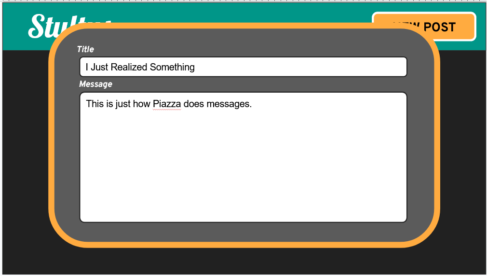

# Phase 1

## User Stories Preview

_As an unauthorized User_, I want to be able to edit messages So that I can
change my ideas based on feedback

- (Automated test of frontend using Mocking)
- (If ACID, can automated test edits on a single test message, otherwise requires a testing DB)
- Can be integration tested live

[Click here for Google Doc](https://docs.google.com/document/d1tA9TysKklLKxRtsTPn_6faa6bT1jq_oNIiBSduttw50/edit)

## Entity Relationship Diagram

## UML Diagram

## Admin FSM

## Web FSM

## Mock User Interface

## Description of Tests

### Backend

### Admin

### Web (and Mobile)
