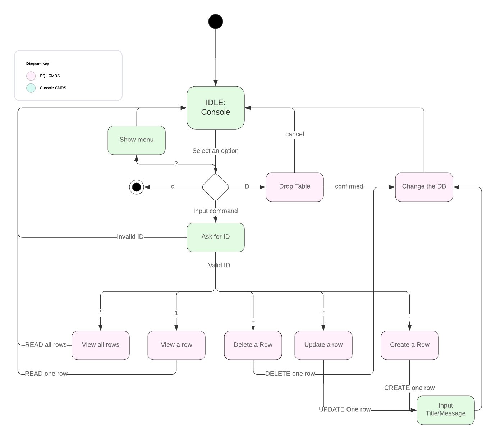
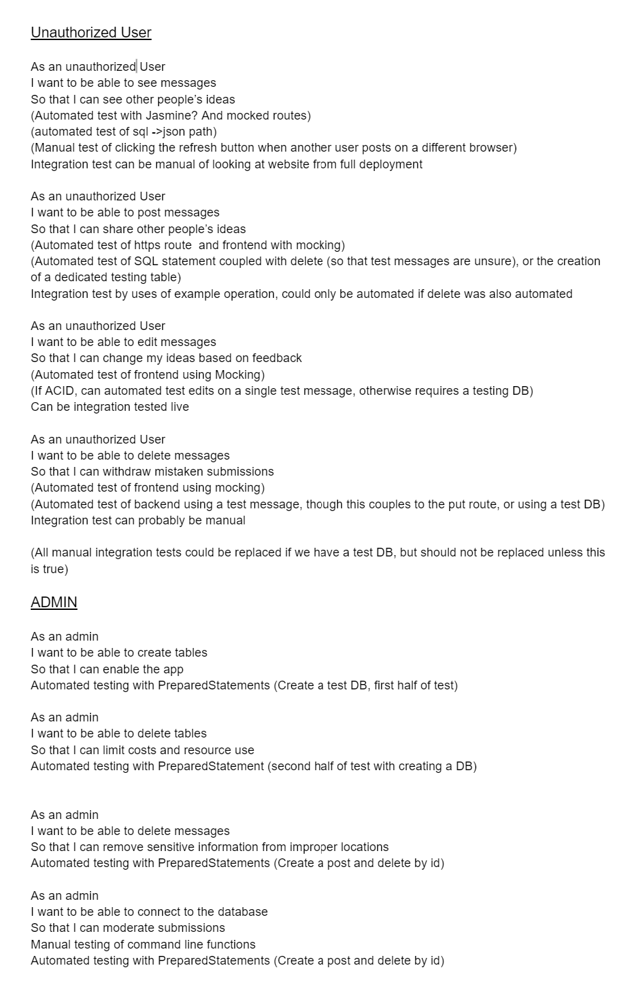

# Phase 1

## User Stories Preview

_As an unauthorized User_, I want to be able to edit messages So that I can
change my ideas based on feedback

- (Automated test of frontend using Mocking)
- (If ACID, can automated test edits on a single test message, otherwise requires a testing DB)
- Can be integration tested live

[Click here for Google Doc](https://docs.google.com/document/d1tA9TysKklLKxRtsTPn_6faa6bT1jq_oNIiBSduttw50/edit)

## Entity Relationship Diagram

## UML Diagram

## Admin FSM

## Web FSM

## Mock User Interface

## User Stories

## Description of Tests

### Backend

Old Tests from `dennyli/tutorials`

- Add NUM_TEST rows to DB
- Execute `selectAll()` and compare if newly added rows exist in DB

### Admin

Old Tests from `dennyli/tutorials`

- Add NUM_TEST rows to DB
- Execute `selectAll()` and compare if newly added rows exist in DB

### Web (and Mobile)

- Add button hides lists of rows
- Check if tests values are in text boxes.

## Routes and details

| Purpose | Route | Verb | Purpose | Structure |
   |---------------------------|------------------|-------|-----------------------------------|-------------------------------------------|
   | Show all messages | /messages | GET | Return post data to display | Json{ArrayList<messages>} |
   | Show one post | /messages/id | GET | Return single post data | Json{message} |
   | Create new Post | /messages | POST | Creates a post | Takes {title, message}, all other fields handled by backend |
   | Edit content of a post | /messages/id | PUT | Edits a post | Takes {title, message} like creation |
   | Delete a post | /messages/id | DELETE| Deletes a post | Returns status |
   | Like a post | /messages/id/like| PUT | Likes a post | Returns new number of likes |
