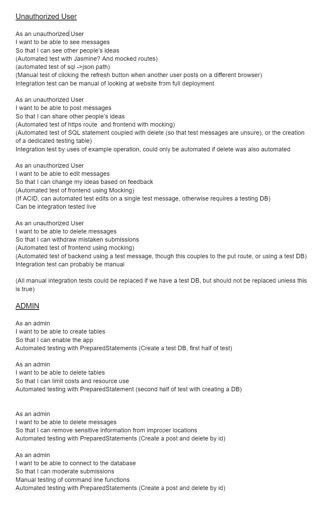

# Phase 2 

## User Stories Preview

_As an unauthorized User_, I want to be able to edit messages So that I can
change my ideas based on feedback

- (Automated test of frontend using Mocking)
- (If ACID, can automated test edits on a single test message, otherwise requires a testing DB)
- Can be integration tested live

[Click here for Google Doc](https://docs.google.com/document/d1tA9TysKklLKxRtsTPn_6faa6bT1jq_oNIiBSduttw50/edit)

## Entity Relationship Diagram

## UML Diagram

## Admin FSM

## Web FSM

## Mock User Interface

## User Stories

## Description of Tests (Automated)

### Backend

- Test for insert and selectall database method
- Test for delete (relies on insert)
- Test for update
- Test for toggling likes
- Test that single row select and multi row select return the same rows

All tests test at least one random subject message pair

May wish to add edge case testing (such as overlength messages or empty messages)

### Admin

- Create a randomly generated String, and adding that String as a new element in the table
- Ensuring the elements have been added
- Deleting added Elements
- Ensuring Elements added have been deleted.

### Web

- Add button hides lists of rows
- Check if tests values are in text boxes.
- Clicking the like button and deleting the test element

## Routes and details

| Purpose                | Route               | Verb   | Purpose                     | Structure                                                     |
| ---------------------- | ------------------- | ------ | --------------------------- | ------------------------------------------------------------- |
| Show all messages      | `/messages`         | GET    | Return post data to display | JSON `{ArrayList<messages>}`                                  |
| Show one post          | `/messages/id`      | GET    | Return single post data     | JSON `{title, message, numLikes}`                             |
| Create new Post        | `/messages`         | POST   | Creates a post              | Takes `{title, message}`, all other fields handled by backend |
| Edit content of a post | `/messages/id`      | PUT    | Edits a post                | Takes `{title, message}` and backend handles updates          |
| Delete a post          | `/messages/id`      | DELETE | Deletes a post              | Returns `status`                                              |
| Like a post            | `/messages/id/like` | PUT    | Likes a post                | Returns new number of `numLikes`                              |

## Documentation for Branches
- [Admin](../admin-cli/README.md)
- [Backend](../backend/README.md)
- [Web](../web/README.md#documentation)
