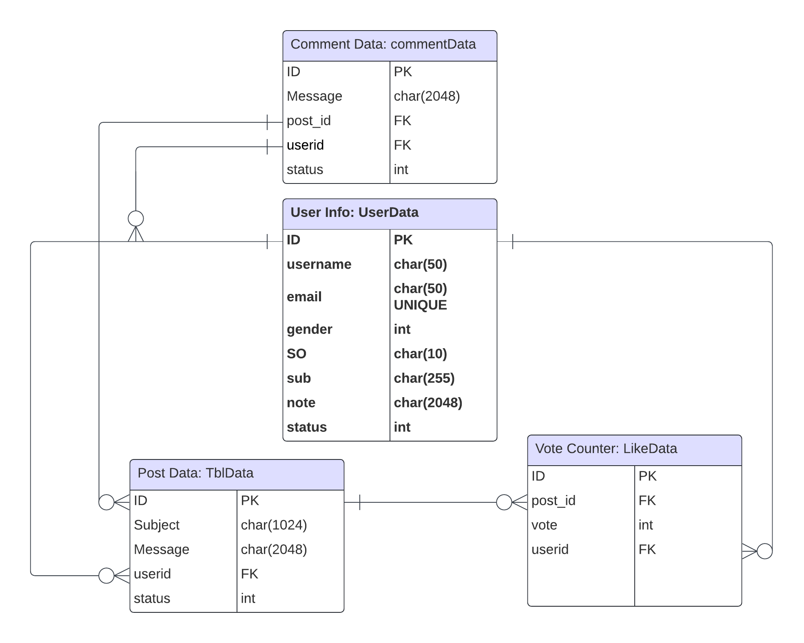
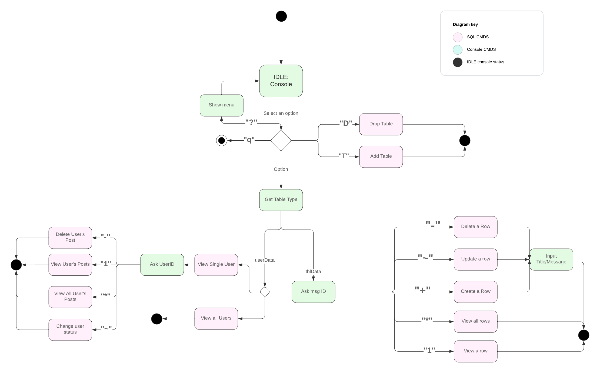

# Phase 2

[Click here for Google Doc](https://docs.google.com/document/d1tA9TysKklLKxRtsTPn_6faa6bT1jq_oNIiBSduttw50/edit)

## Entity Relationship Diagram

## UML Diagram

## Admin FSM

## Web FSM

## Idea FSm

## Mock User Interface

Comment operations and profile will maintain visual consistency with the site

## User Stories

As an authorized User

I want to be able to log in

(MUST BE MANUAL TEST BECAUSE GOOGLE USES CAPTCHA)

Because security policy says that I cannot do anything else without it

---

As an authorized User

I want to be able to see my profile

So I can see information that you know about me

(Automated Test with jasmine on frontend)

(Automated Test get on backend.)

Integration test can probably be manual

---

As an authorized user

I want to be able to edit my profile

To correct information I don’t like

(Automated test with jasmine?)

(Test on backend on test user)

Integration test can probably be manual

---

As an authorized user

I want to be able to like, unlike and dislike ideas

To show my approval and disapproval

(Automated test of backend and sql)

(Automated test of frontend with jasmine)

Integration test can probably be manual

---

As a authorized User

I want to be able to see messages

So that I can see other people’s ideas

(Automated test with Jasmine? And mocked routes)

(automated test of sql ->json path)

(Manual test of clicking the refresh button when another user posts on a different browser)

Integration test can be manual of looking at website from full deployment

---

As a authorized User

I want to be able to post messages

So that I can share other people’s ideas

(Automated test of https route and frontend with mocking)

(Automated test of SQL statement coupled with delete (so that test messages are unsure), or the creation of a dedicated testing table)

Integration test by uses of example operation, could only be automated if delete was also automated

---

As an authorized User

I want to be able to edit messages

So that I can change my ideas based on feedback

(Automated test of frontend using Mocking)

(If ACID, can automated test edits on a single test message, otherwise requires a testing DB)

Can be integration tested live

---

As an authorized User

I want to be able to delete messages

So that I can withdraw mistaken submissions

(Automated test of frontend using mocking)

(Automated test of backend using a test message, though this couples to the put route, or using a test DB)

Integration test can probably be manual

---

As an authorized User

I want to be able to comment on messages

So that I can give feedback

(Automated Test of frontend using jasmine and mocking)

(Automated Test of backend using comment on test message)

Integration test manaul

---

As an authorized User

I want to be able to delete my comments

so that I can remove bad feedback

(Automated Test on frontend using mocking)

(Automated Test of backend using the same test comment as the test for creating comments)

Integration test manual

---

(All manual integration tests could be replaced if we have a test DB, but should not be replaced unless this is true)

---

As an admin

I want to be able to create tables

So that I can enable the app

Automated testing with PreparedStatements (Create a test DB, first half of test)

---

As an admin

I want to be able to delete tables

So that I can limit costs and resource use

Automated testing with PreparedStatement (second half of test with creating a DB)

---

As an admin

I want to be able to delete messages

So that I can remove sensitive information from improper locations

Automated testing with PreparedStatements (Create a post and delete by id)

---

As an admin

I want to be able to connect to the database

So that I can moderate submissions

Manual testing of command line functions

Automated testing with PreparedStatements (Create a post and delete by id)

---

As an admin

I want to be able remove users

For violating terms of service (or cause they were fired)

Manual or automated test of prepared statment

---

As an admin

I want to be able to prepopulate tables

To allow information to persist across transfers

Manual or Automated Testing of prepared statments to post to all tables

---

## Description of Tests (Automated)

### Backend

- Test for insert and selectall database method
- Test for delete (relies on insert)
- Test for update
- Test for toggling likes
- Test that single row select and multi row select return the same rows

All tests test at least one random subject message pair

May wish to add edge case testing (such as overlength messages or empty messages)

### Admin

- Create a randomly generated String, and adding that String as a new element in the table
- Ensuring the elements have been added
- Deleting added Elements
- Ensuring Elements added have been deleted.

### Web

- Add button hides lists of rows
- Check if tests values are in text boxes.
- Clicking the like button and deleting the test element

## Routes and details

### Current methods

| Purpose                | Route                        | Verb   | Purpose                             | Structure                                                             |
| ---------------------- | ---------------------------- | ------ | ----------------------------------- | --------------------------------------------------------------------- |
| Show all messages      | `/messages`                  | GET    | Return post data to display         | JSON `{ArrayList<messages>}`                                          |
| Show one post          | `/messages/id`               | GET    | Return single post data             | JSON `{title, message, numLikes, userID}`                             |
| Create new Post        | `/user/userID/addMessage`    | POST   | Creates a post                      | Takes `{title, message, userID}`, all other fields handled by backend |
| Edit content of a post | `/user/userID/editMessage`   | PUT    | Edits a post                        | Takes `{title, message, userID}` and backend handles updates          |
| Delete a post          | `/user/userID/deleteMessage` | DELETE | Deletes a post                      | Returns `status`                                                      |
| Upvote a post          | `/user/userID/upvote/id`     | PUT    | Vote on a post                      | Returns `1` on success                                                |
| Downvote a post        | `/user/userID/downvote/id`   | PUT    | Vote on a post                      | Returns `1` on success                                                |
| Show user profile      | `/user/userID`               | GET    | Retreive user info                  | JSON `{mId, mUsername, mEmail}`                                       |
| Authenticate user      | `/authenticate`              | POST   | Get Oauth token, add user if needed | JSON `{status, {mId, mUsername, mEmail, mGender, mSO}}`               |

### Phase 1 methods: Outdated but not removed yet

| Purpose                  | Route               | Verb   | Purpose        | Structure                                                     |
| ------------------------ | ------------------- | ------ | -------------- | ------------------------------------------------------------- |
| Like a post (deprecated) | `/messages/id/like` | PUT    | Likes a post   | Returns new number of `numLikes`                              |
| Create new Post          | `/messages`         | POST   | Creates a post | Takes `{title, message}`, all other fields handled by backend |
| Edit content of a post   | `/messages/id`      | PUT    | Edits a post   | Takes `{title, message}` and backend handles updates          |
| Delete a post            | `/messages/id`      | DELETE | Deletes a post | Returns `status`                                              |

## Documentation for Branches

- [Admin](../admin-cli/README.md)
- [Backend](../backend/README.md)
- [Web](../web/README.md#documentation)
